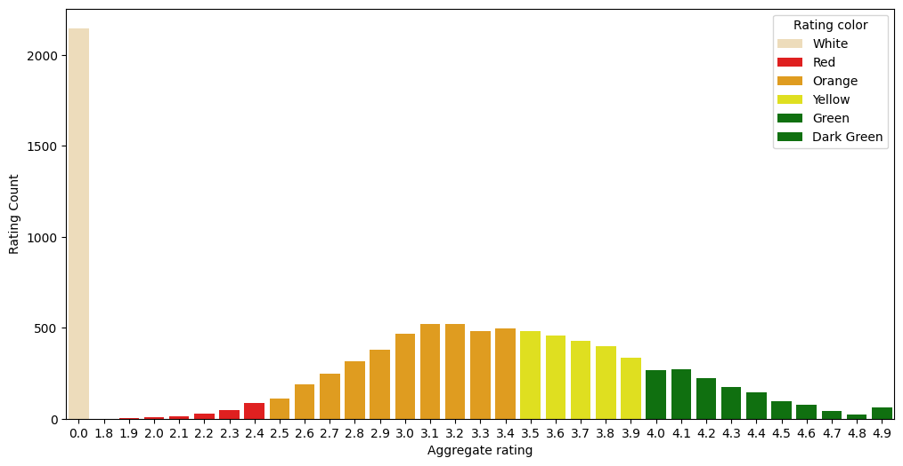
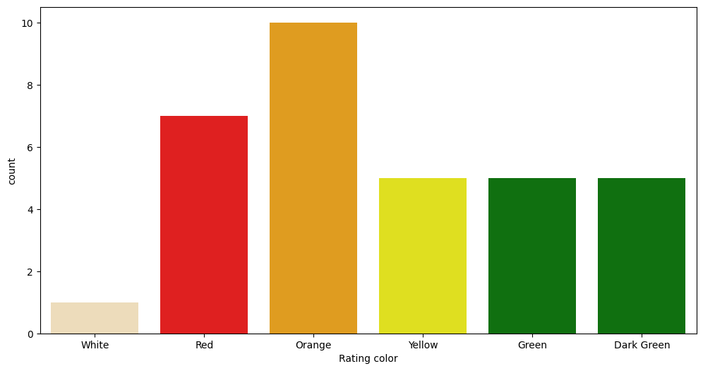
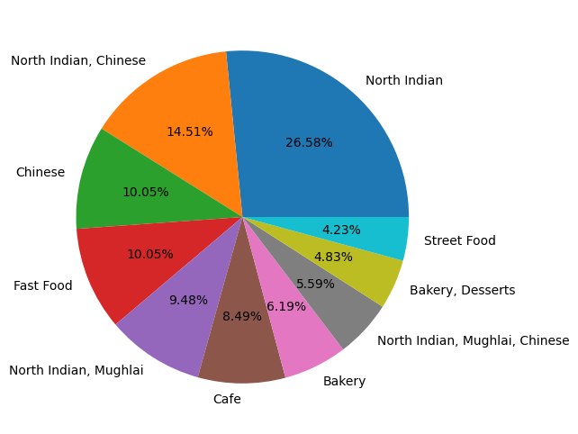
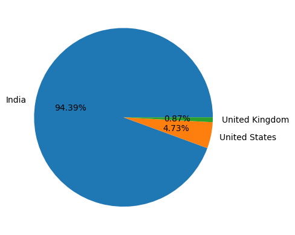
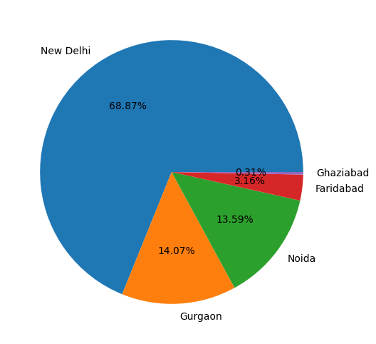

# 🍽️ Zomato Data Analysis (EDA)

## 📌 Problem Statement
The goal of this project is to perform Exploratory Data Analysis (EDA) on a Zomato dataset to uncover meaningful insights about restaurant trends, customer preferences, pricing, and ratings.

---

## 📊 Dataset Information
- Dataset: Zomato Restaurant Data  
- Contains information such as:
  - Restaurant name
  - Location
  - Cuisines
  - Cost for two
  - Ratings
  - Votes

---

## 🛠️ Tools & Technologies Used
- Python 🐍  
- Pandas  
- NumPy  
- Matplotlib  
- Seaborn  
- Jupyter Notebook  

---

## 🧹 Data Cleaning Steps
- Removed missing/null values  
- Dropped duplicate records  
- Converted data types for analysis  
- Cleaned inconsistent entries (cost, ratings, etc.)

---

## 📈 Exploratory Data Analysis (EDA)

### 🔹 Rating Analysis
- Distribution of restaurant ratings
- Most restaurants fall within a specific rating range

### 🔹 Cost Analysis
- Relationship between cost and ratings
- Mid-range priced restaurants tend to perform better

### 🔹 Cuisine Analysis
- Identified most popular cuisines
- Multi-cuisine restaurants are more common

### 🔹 Location Analysis
- Certain locations have higher restaurant density
- Popular areas show higher engagement (votes)

---

## 💡 Key Insights
- ⭐ Restaurants with moderate pricing often receive better ratings  
- 🍜 Certain cuisines dominate customer preference  
- 📍 Location plays a crucial role in restaurant success  
- 📊 Higher votes generally correlate with better ratings  

---

## 📸 Project Screenshots

### Ratings Distribution


### Cost vs Rating


### Top Cuisines



### Top Country


### Top City



---

## 📎 Project Files
- Jupyter Notebook: `Zomato_EDA.ipynb`
- Dataset: (Add dataset link if available)

---

## 🚀 How to Run This Project
```bash
git clone https://github.com/your-username/zomato-eda.git
cd zomato-eda
pip install -r requirements.txt
jupyter notebook
